# Polling App on Google Cloud

A simple distributed application.

## Getting started

### **YOU ONLY NEED A GOOGLE ACCOUNT FOR IT AND NOTHING LOCALLY**  

IF YOU WANT TO MAKE YOUR OWN DOCKER IMAGES –
1.	Clone the project repository
https://github.com/twinkll/voting-app.git

2.	Navigate to project directory 
3.	Navigate to VOTE folder 
-	docker build -t < docker-username >/vote
-	docker push < docker-username >/vote
4.	Navigate to RESULT folder
-	docker build -t < docker-username >/result
-	docker push < docker-username >/result
5.	Navigate to WORKER folder
-	docker build -t < docker-username >/worker
-	docker push < docker-username >/worker

CREATE KUBERNETES CONFIGURATION FILES –
You can refer my GIT repository - https://github.com/twinkll/polling-app-kubernetes.git

YOU CAN ALSO SKIP THE ABOVE STEPS AND USE MY DOCKER IMAGES AND KUBERNETES CONFIGURATION FILES

## NOW FOLLOW THESE STEPS –

1.	Create a cluster on Google Kuberenetes Engine 

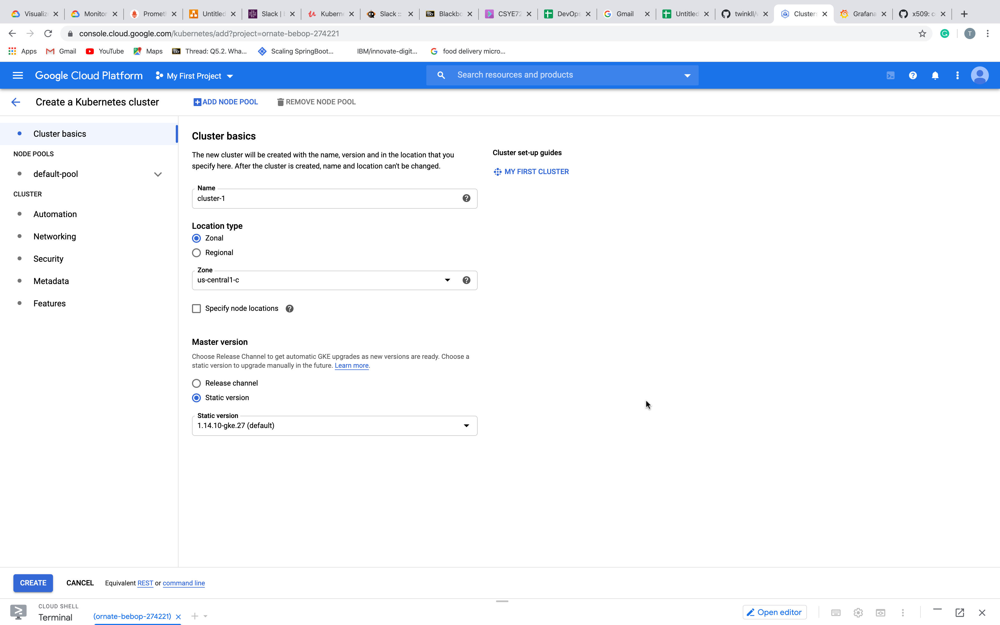

2.	Hit CONNECT button and copy the command-line access.
Open the CLOUD SHELL from top right corner and connect to the CLUSTER by entering this command

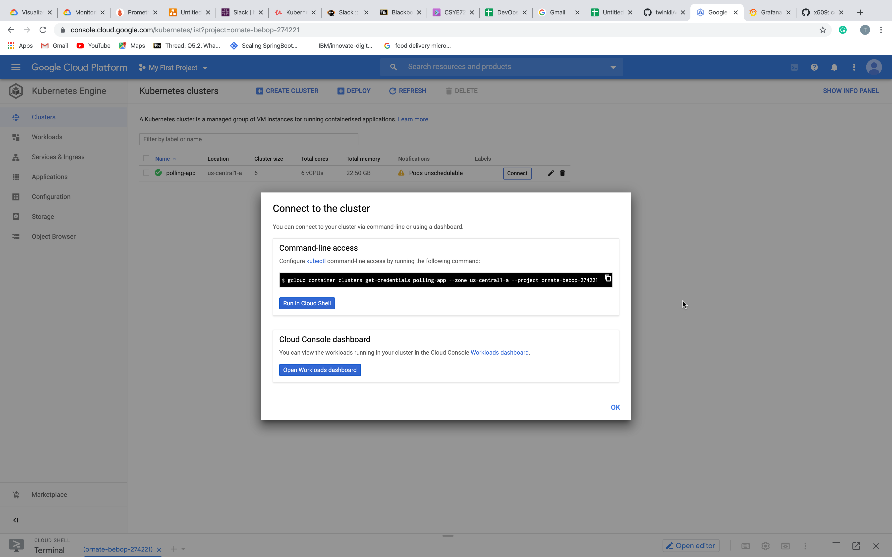

3.	Once connected you can clone the GIT repository consisting k8s YAML filed
```
    https://github.com/twinkll/polling-app-kubernetes.git
```
Create all deployments and services 
```    
    Kubectl create -f voting-app-deployment.yaml
    Kubectl create -f voting-app-service.yaml
    Kubectl create -f result-app-deployment.yaml
    Kubectl create -f result-app-service.yaml
    Kubectl create -f worker-app-deployment.yaml
    Kubectl create -f redis-deployment.yaml
    Kubectl create -f redis-service.yaml
    Kubectl create -f postgres-deployment.yaml
    Kubectl create -f postgres-service.yaml
```
FINAL RESULTING APPLICATION 
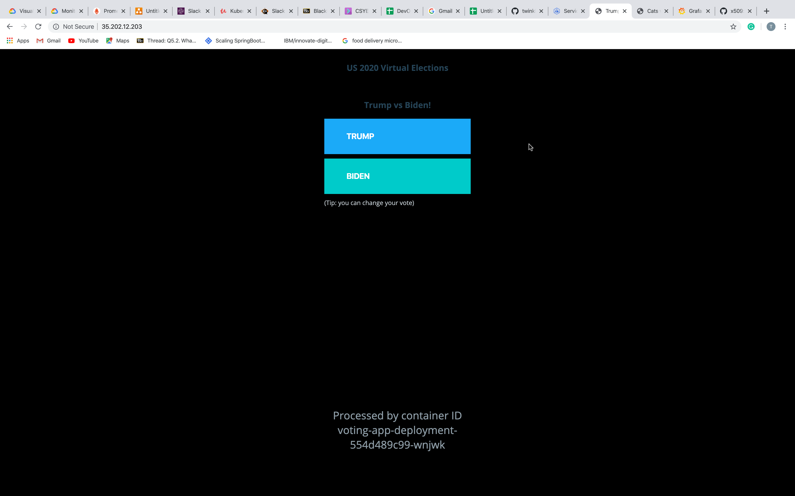

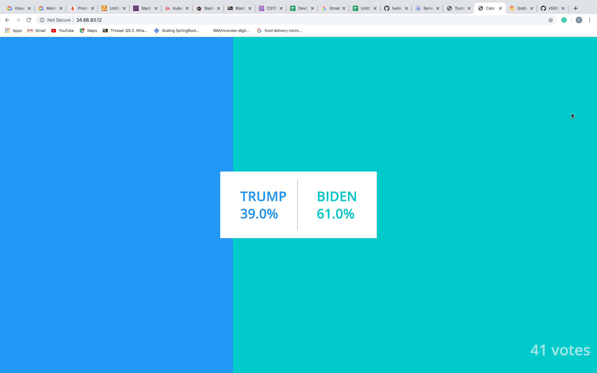

## TELEMETRY

Create a namespace 
```
    kubectl create namespace monitoring
```
Create YAML files 
```
    kubectl create -f clusterRole.yaml
    kubectl create -f config-map.yaml
    kubectl create -f prometheus-deployment.yaml
    kubectl create -f prometheus-service.yaml --namespace=monitoring
    kubectl get pods --namespace=monitoring
```
Run : kubectl port-forward prometheus-deployment-6b4bc56649-fh5fw 8080:9090 -n monitoring

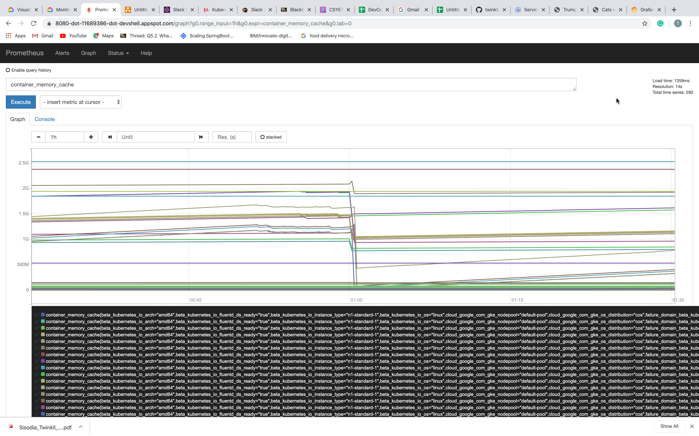

FOR GARAFANA DASHBOARD

Go to APPLICATIONS on Google Cloud Platform Kuberenetes Engine dashboard

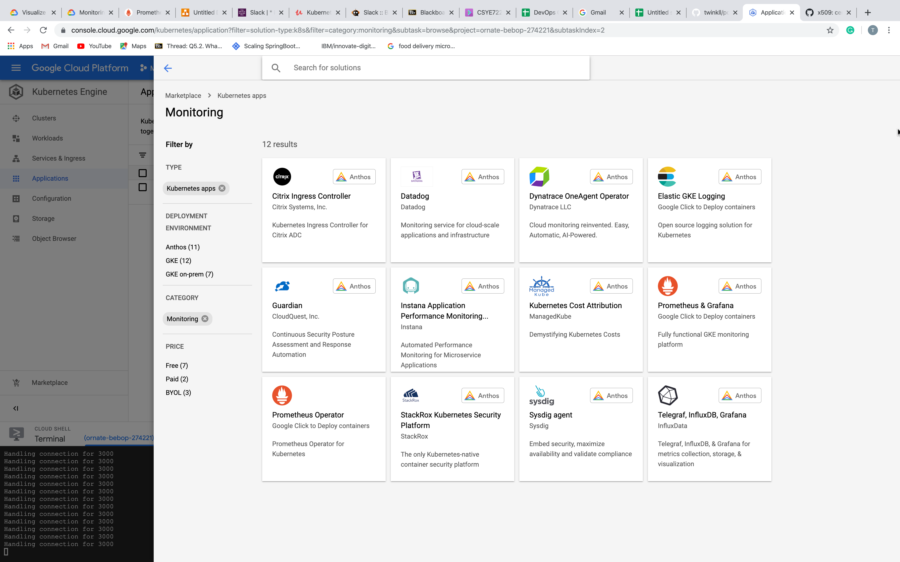

Configure
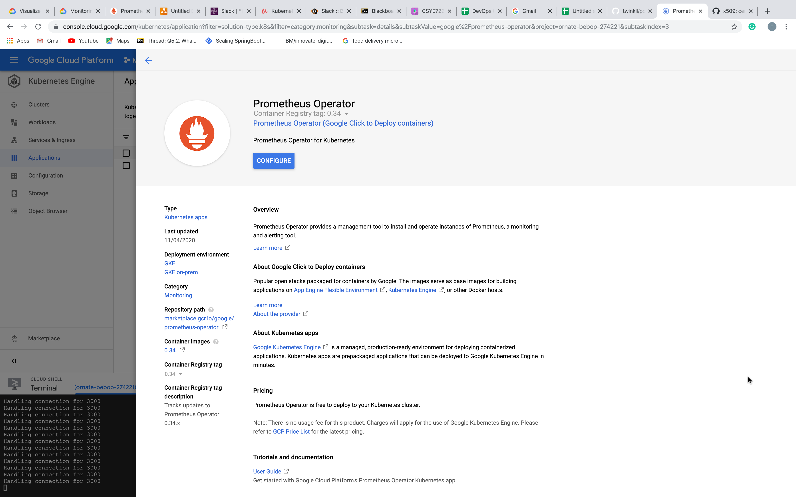

Deploy on GKE
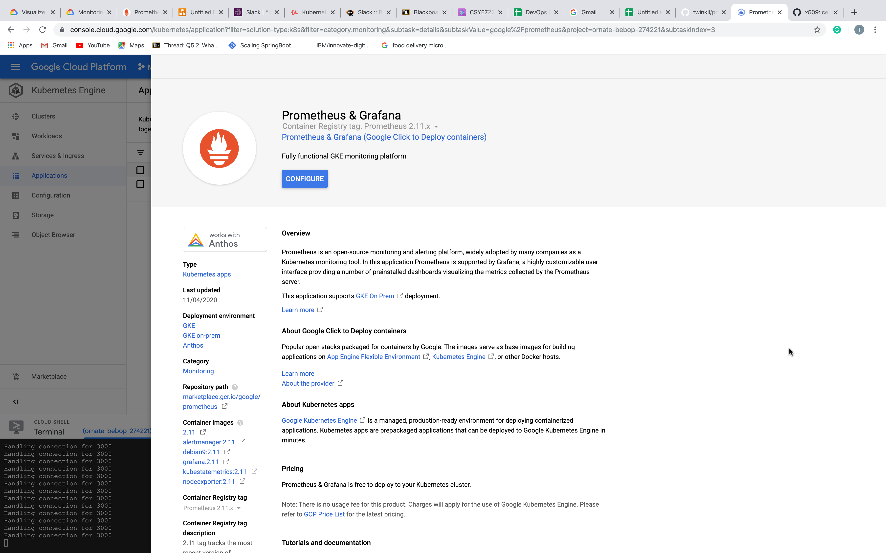

It will automatically deploy YAML files on the cluster.
Run Prometheus and Grafana – 
kubectl port-forward --namespace polling-app prometheus-1-grafana-0 3000

You can web preview to port 3000
Grafana Username and Password can be found on the dashboard 
![Grafana dashboard]

## ALERT SYSTEM

Add to Slack
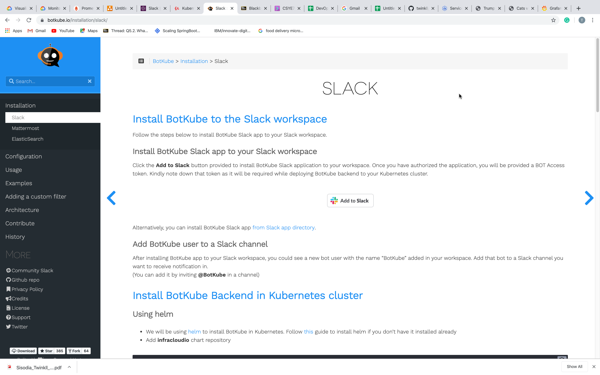

Copy and save this token
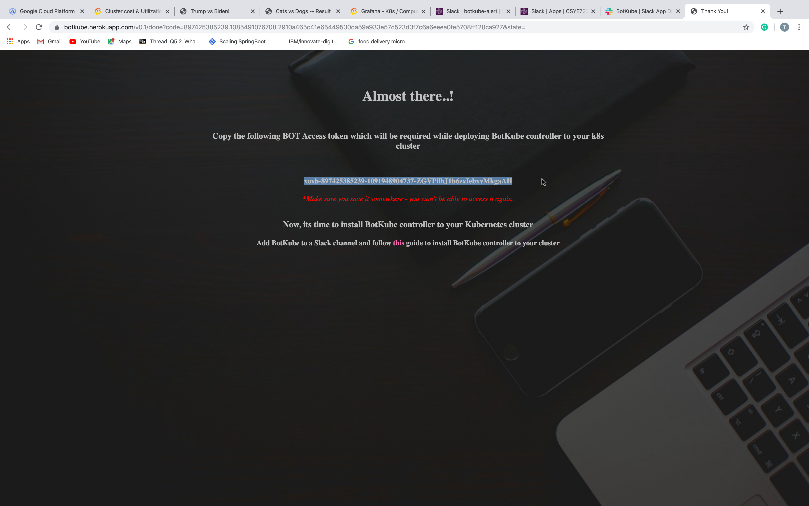

After installing BotKube app to your Slack workspace, you could see a new bot user with the name “BotKube” added in your workspace. Add that bot to a Slack channel you want to receive notification in. (You can add it by inviting @BotKube in a channel)

Install BOTKUBE backend in Kubernetes cluster
 We will be using helm to install BotKube in Kubernetes
 Add infracloud repository
```
    helm repo add infracloudio https://infracloudio.github.io/charts
```
Deploy BOTKUBE backend using helm install in your cluster
```   
    helm repo update
    helm install --version v0.9.1 --name botkube --namespace botkube \
    --set config.communications.slack.enabled=true \
    --set config.communications.slack.channel=<SLACK_CHANNEL_NAME> \
    --set config.communications.slack.token=<SLACK_API_TOKEN_FOR_THE_BOT> \
    --set config.settings.clustername=<CLUSTER_NAME> \
    --set config.settings.allowkubectl=<ALLOW_KUBECTL> \
    --set image.repository=infracloudio/botkube \
    --set image.tag=v0.9.1 \
    infracloudio/botkube
```

We will now get alerts on cluster operations like : pod/deployment/service creation or deletion or modification.
We can also perform KUBECTL commands from slack :

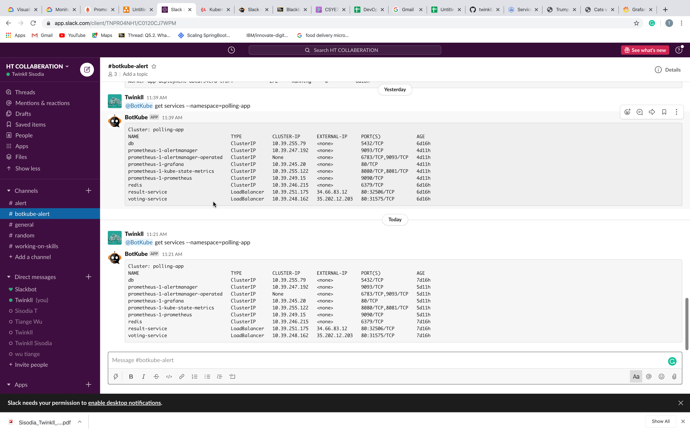
```
    @BotKube get pods --namespace=monitoring
    @BotKube get services --namespace=monitoring
```
